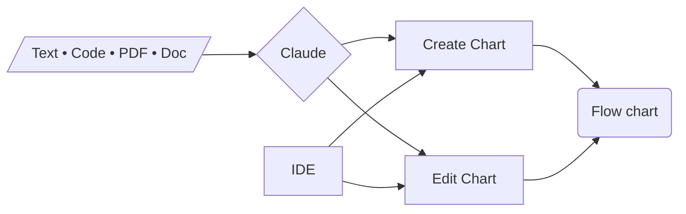

# Mermaid AI editor

Create and edit Mermaid flow charts with AI (Claude).

Upload text, code files, PDF and Word documents.

_

---

**How to use locally**

Add your `ANTHROPIC_API_KEY` to the `.env` file in the server directory and you're good to go!

---

