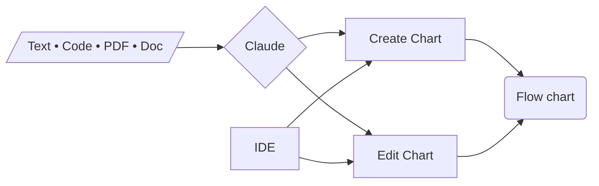

# Mermaid AI editor

Create and edit Mermaid diagrams and flowcharts with AI (Claude).

Upload text, code files, PDF and Word documents.

Ask the model for global or targeted changes, or edit directly the code and the diagram.

---
**Demo**

---
**Light mode**

---
**Dark mode**

---

**How to use locally**

Add your `ANTHROPIC_API_KEY` to a `.env` file in the server directory and you're good to go!

---

**Copy the diagram code to Markdown files**

GitHub supports Mermaid rendering in Markdown!

