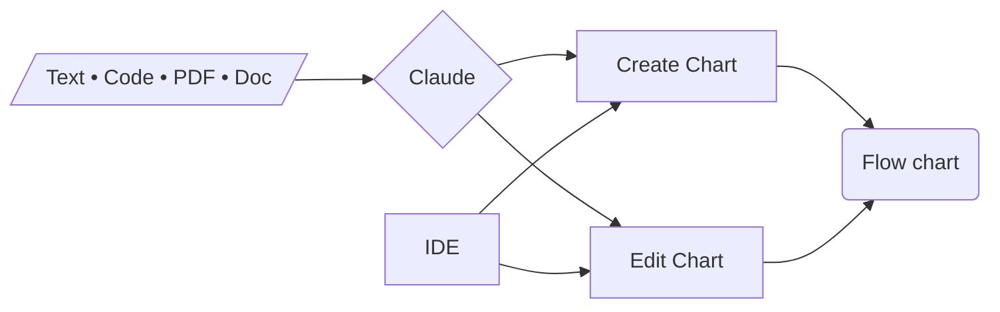

# Mermaid AI editor

Create and edit Mermaid diagrams with AI (Claude).

Upload text, code files, PDF and Word documents. Ask AI or edit directly the code and the diagram.

---

---

**How to use locally**

Add your `ANTHROPIC_API_KEY` to the `.env` file in the server directory and you're good to go!

---

GitHub supports Mermaid rendering in Markdown!
